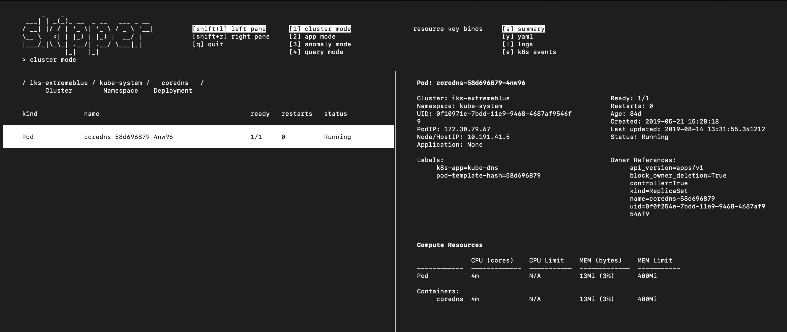
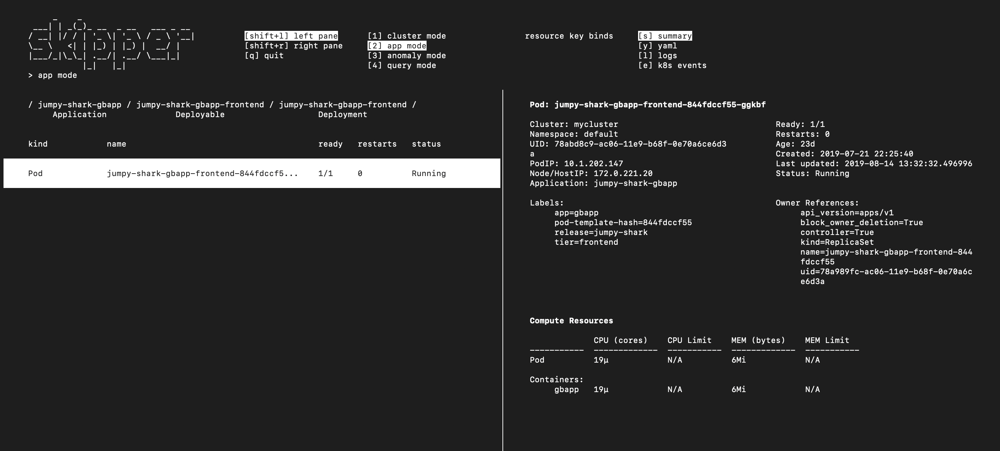
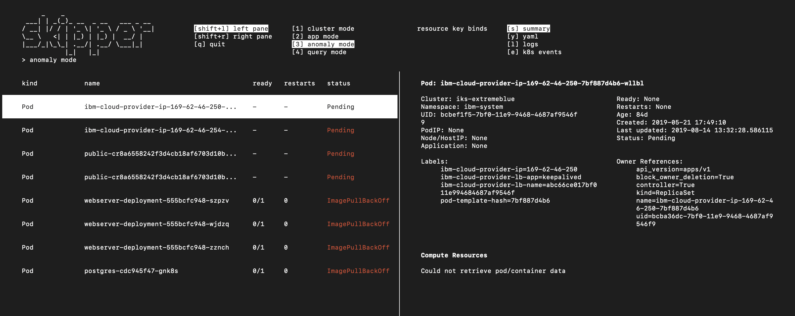
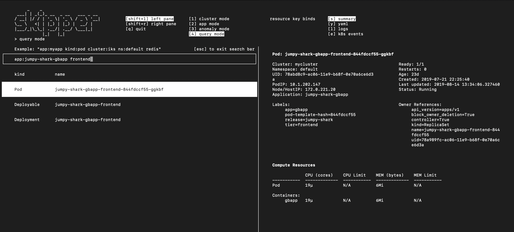

# Skipper

Skipper is an interactive terminal tool for managing multiple kubernetes clusters.

## Installation and Setup

Before you start, you will need to have python3 and pip3 installed. Then run
```
git clone git@github.com:IBM/multicloud-incident-response-navigator.git skipper
cd skipper
chmod +x ./installer && ./installer
```

If you are unable to clone using SSH, download ZIP and follow starting from the second instruction.

## Running Skipper
In the skipper/ directory, run
```
./skipper
```
On startup, Skipper will locate your kube-config by looking at the `KUBECONFIG` environment variable. If this is empty, it will look at the default location (`~/.kube/config`).

Skipper loads your kube-config in order to get information from your clusters, and will never create, modify, or delete any of your kubernetes resources.

## Logs
Logs are stored in the `logs/` directory. `flask.log` contains output from the flask webserver, `crawler.log` contains output from the crawler, and `skipper.log` contains output from the frontend curses application.

## Usage
Skipper usage walkthrough video: [using skipper](https://drive.google.com/file/d/1YwRw4IWjyeEo7fTZld_DCT54ZPJgEl5h/view?usp=sharing)

### navigation keybinds
`->` or `ENTER`:  navigate into a resource

`<-` or `BACKSPACE`: 	navigate out of a resource

[left pane] `up` and `down` arrows: go up / down a list of resources

[right pane] `up` and `down` arrows: scroll

### cluster mode



Cluster mode presents your kubernetes resources in the following hierarchy:

`cluster -> ns -> {deployment,daemonset,statefulset,service} -> pod`

Note: currently standalone pods (those not being managed by a deployment) do not show up in cluster mode.

### app mode



App mode presents your kubernetes resources in the following hierarchy:

`Application -> Deployable -> {deployment,daemonset,statefulset,service} -> pod`

Application and Deployable are custom resource definitions specified by IBM's Multicloud Manager. If none of your clusters have the Application or Deployable crds, app mode will be disabled for you.


### anomaly mode



Anomaly mode presents a curated shortlist of pods across your clusters that are in an error state.

### query mode



Query mode lets you search for resources across all your clusters. Currently query mode supports keyword search and filters. Supported filters are `app`, `cluster`, `ns`, `kind`. You can apply as many filters as you'd like in succession.

Example queries:

`app:my-app`

Will return all kubernetes resources that belong to the Application named my-app.

`kind:pod frontend`

Will return all pods with 'frontend' in the name.

`cluster:iks-extremeblue ns:default`

Will return all kubernetes resources that reside in the default namespace of the cluster named iks-extremeblue.

### modeswitching
Whenever you have a resource selected and switch to app / cluster mode, Skipper will bring you to the location of the selected resource within the app / cluster hierarchy.

## Architecture Overview
A high level overview of how Skipper works under the hood can be found here: [skipper.pdf](collateral/skipper.pdf)

## Future Work
- Convert run script to a python script (currently in-progress on run-py branch)
- Package Skipper as a python package and upload to the Python Package Index
- Have Skipper automatically adjust when terminal window is resized
- Add additional search bar keybinds for highlighting, copy, paste, cut
- Add infrastructure mode to see the `Node -> pod` hierarchy
- Add ability to exec into containers within pods
- Add ability to open yamls / logs in preferred editor
- Script Skipper backend to allow users to run commands in terminal
- Add related resources to summary panel

## Credits
Extreme Blue 2019, RTP Lab

Sponsored by Dave Lindquist and the IBM Cloud Private team

### Interns
<table>
	<tr>
		<td><b> Name </b></td>
		<td><b> School </b></td>
		<td><b> Major </b></td>
		<td><b> Role </b></td>
		<td><b> Email </b></td>
	</tr>
	<tr>
		<td>Patricia Lu</td>
		<td> MIT </td>
		<td> EECS </td>
		<td> EB Technical Intern </td>
		<td> pjlu01@gmail.com </td>
	</tr>
	<tr>
		<td> Jane Hsieh </td>
		<td> Oberlin College </td>
		<td> CS (CSCI) </td>
		<td> EB Technical Intern </td>
		<td> jwhsieh98@gmail.com </td>
	</tr>
	<tr>
		<td> Tom Gong </td>
		<td> UT Austin </td>
		<td> CS / Marketing</td>
		<td> EB Technical Intern </td>
		<td> tom.gong@utexas.edu </td>
	</tr>
	<tr>
		<td> Caitlin Endyke </td>
		<td> UMich </td>
		<td> MBA / HCI </td>
		<td> EB Offering Management Intern </td>
		<td> endyke@umich.edu</td>
	</tr>
</table>

### Mentors
- Ross Grady (RTP EB Lab Manager)
- Shikha Srivastava
- Chris Waldon
- Ethan Swartzentruber
- Ryan Smith
- Yu Cao
- Jorge Padilla
- Kevin Myers
- Michael Elder
- Charles Quincy
- Sanjay Joshi
